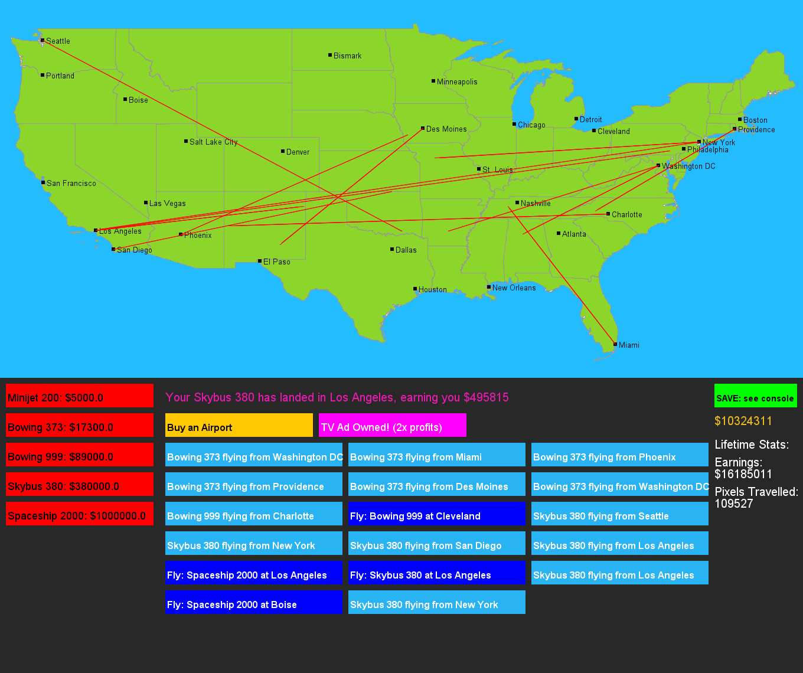

# airline-game
Java Game that Simulates Running an Airline

Developed by Andrew Zhang (2020). Inspired by Pocket Planes. 

Run with Java IDE in `AirlineMain.java`. 

Enter save files with `.txt` extension.

